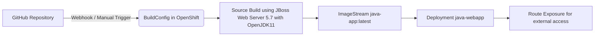

# Java BuildConfig Example on OpenShift

This repository demonstrates how to **build and deploy a simple Java application** in **OpenShift** using a `BuildConfig` with source code from a Git repository. The example shows how to build a WAR/JAR file using Maven, push it to an OpenShift ImageStream, and deploy it as a running application accessible via a route.

---

## 📋 Prerequisites

* Access to an **OpenShift** cluster with the `oc` CLI installed and logged in.
* A GitHub repository with your Java application.
* Basic understanding of OpenShift **Projects**, **ImageStreams**, **BuildConfigs**, and **Routes**.

---

## 🚀 Quick Start

If you want to quickly test the example:

1. Fork this repository to your GitHub account.
2. Update the **BuildConfig** and secrets to point to your forked repository.
3. Apply the OpenShift configuration as outlined below.

---

## 🛠 Optional: Create the Java Project from Scratch

### 1️⃣ Generate a Maven Project

```bash
mvn archetype:generate \
    -DgroupId=com.example \
    -DartifactId=myapp \
    -DarchetypeArtifactId=maven-archetype-quickstart \
    -DinteractiveMode=false
cd myapp
```

### 2️⃣ Update `pom.xml`

```xml
<project xmlns="http://maven.apache.org/POM/4.0.0"
         xmlns:xsi="http://www.w3.org/2001/XMLSchema-instance"
         xsi:schemaLocation="http://maven.apache.org/POM/4.0.0
                             https://maven.apache.org/xsd/maven-4.0.0.xsd">
    <modelVersion>4.0.0</modelVersion>

    <groupId>com.example</groupId>
    <artifactId>myapp</artifactId>
    <version>1.0-SNAPSHOT</version>
    <packaging>war</packaging>

    <properties>
        <maven.compiler.source>11</maven.compiler.source>
        <maven.compiler.target>11</maven.compiler.target>
    </properties>

    <dependencies>
        <!-- Servlet API -->
        <dependency>
            <groupId>jakarta.servlet</groupId>
            <artifactId>jakarta.servlet-api</artifactId>
            <version>5.0.0</version>
            <scope>provided</scope>
        </dependency>

        <!-- JUnit for testing -->
        <dependency>
            <groupId>junit</groupId>
            <artifactId>junit</artifactId>
            <version>4.13.2</version>
            <scope>test</scope>
        </dependency>
    </dependencies>

    <build>
        <plugins>
            <!-- Compiler Plugin -->
            <plugin>
                <groupId>org.apache.maven.plugins</groupId>
                <artifactId>maven-compiler-plugin</artifactId>
                <version>3.10.1</version>
                <configuration>
                    <source>${maven.compiler.source}</source>
                    <target>${maven.compiler.target}</target>
                </configuration>
            </plugin>

            <!-- WAR Plugin -->
            <plugin>
                <groupId>org.apache.maven.plugins</groupId>
                <artifactId>maven-war-plugin</artifactId>
                <version>3.3.2</version>
                <configuration>
                    <failOnMissingWebXml>false</failOnMissingWebXml>
                </configuration>
            </plugin>
        </plugins>
    </build>
</project>
```

Commit and push the project to your GitHub repository.

---

## 📦 Deployment on OpenShift

### 1️⃣ Create a New Project

```bash
oc new-project java-bc
```

### 2️⃣ Create Secrets for GitHub Access

```bash
oc create secret generic github-https \
    --type=kubernetes.io/basic-auth \
    --from-literal=username=GITHUB_USER \
    --from-literal=password=YOUR_PAT \
    --namespace=java-bc
```

```bash
oc create secret generic github-webhook \
    --from-literal=WebHookSecretKey=MY_WEBHOOK_SECRET \
    --namespace=java-bc
```

> Replace:
>
> * `GITHUB_USER` → your GitHub username
> * `YOUR_PAT` → your personal access token
> * `MY_WEBHOOK_SECRET` → chosen webhook secret

### 3️⃣ Create an ImageStream

```bash
oc create imagestream java-app -n java-bc
```

### 4️⃣ Apply the BuildConfig

Save as `buildconfig.yaml`:

```yaml
apiVersion: build.openshift.io/v1
kind: BuildConfig
metadata:
  name: java-app-git
  namespace: java-bc
spec:
  output:
    to:
      kind: ImageStreamTag
      name: 'java-app:latest'
  resources: {}
  successfulBuildsHistoryLimit: 2
  failedBuildsHistoryLimit: 1
  strategy:
    type: Source
    sourceStrategy:
      from:
        kind: ImageStreamTag
        namespace: openshift
        name: 'jboss-webserver57-openjdk11-tomcat9-openshift-ubi8:latest'
      incremental: false
  source:
    type: Git
    git:
      uri: 'YOUR_REPO_URL'
      ref: main
    sourceSecret:
      name: github-https
  triggers:
    - type: ConfigChange
    - type: ImageChange
      imageChange: {}
    - type: GitHub
      github:
        secretReference:
          name: github-webhook
  runPolicy: Serial
```

Apply it:

```bash
oc apply -f buildconfig.yaml
```

### 5️⃣ Start the Build

```bash
oc start-build java-app-git --follow
```

### 6️⃣ Deploy the Application

```bash
oc new-app java-bc/java-app:latest --name java-webapp
```

### 7️⃣ Expose the Service via a Route

```bash
oc expose service/java-webapp
```

### 8️⃣ Verify the Deployment

```bash
oc get route java-webapp
curl http://<route-host>
```

Expected output:

```
Hello World!
```

---

## 🔄 Automatic Redeployment (CI/CD)

You can configure **automatic builds and deployments** whenever you push changes to GitHub.

1. Ensure your `BuildConfig` has the **GitHub trigger**:

```yaml
triggers:
- type: GitHub
  github:
    secretReference:
      name: github-webhook
```

2. On GitHub, create a **Webhook**:

* Payload URL: `https://<openshift-webhook-url>/oapi/v1/namespaces/java-bc/buildconfigs/java-app-git/webhooks/MY_WEBHOOK_SECRET/github`
* Content type: `application/json`
* Secret: `MY_WEBHOOK_SECRET`
* Trigger: `Just the push event`

3. Push changes to your GitHub repository.

4. OpenShift automatically starts a new build and updates the deployed application with the new image.

---

## 🔍 Verification Commands

```bash
oc get builds
oc get is java-app
oc get pods
oc get route java-webapp
```

---

## 📊 Workflow Diagram



This diagram illustrates:

1. Code is pushed to GitHub.
2. Webhook or manual trigger starts the BuildConfig.
3. OpenShift builds the Java application image.
4. Image is stored in an ImageStream.
5. Deployment is updated with the new image.
6. Application is exposed via a route for external access.

---

## 📚 References

* [OpenShift BuildConfig Documentation](https://docs.openshift.com/container-platform/latest/cicd/builds/understanding-buildconfigs.html)
* [Maven Official Guide](https://maven.apache.org/guides/)
* [JBoss Web Server S2I Images](https://access.redhat.com/containers/?tab=overview#/registry.access.redhat.com/jboss-webserver57/openjdk11-tomcat9-openshift)

