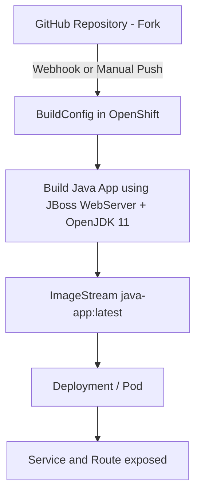

# Java BuildConfig Example on OpenShift

This repository demonstrates how to build and deploy a simple Java application in **OpenShift** using a `BuildConfig` with source code from a Git repository.

---

## 📋 Prerequisites

* Access to an **OpenShift** cluster with the `oc` CLI installed and logged in.
* A GitHub account with a personal access token (PAT).
* Basic knowledge of OpenShift Projects, ImageStreams, BuildConfigs, and pipelines.

---

## 🚀 Quick Start (Recommended)

1. **Fork this repository** to your GitHub account.
2. Update the Git URL in the `buildconfig.yaml` to point to your fork.
3. Apply the OpenShift configuration (steps below).

> This method ensures that all builds and deployments use your own fork, keeping your CI/CD isolated.

---

## 📦 Deployment on OpenShift

### 1️⃣ Create a New Project

```bash
oc new-project java-bc
```

### 2️⃣ Create GitHub Secrets

```bash
oc create secret generic github-https \
    --type=kubernetes.io/basic-auth \
    --from-literal=username=GITHUB_USER \
    --from-literal=password=YOUR_PAT \
    --namespace=java-bc

oc create secret generic github-webhook \
    --from-literal=WebHookSecretKey=MY_WEBHOOK_SECRET \
    --namespace=java-bc
```

> Replace:
>
> * `GITHUB_USER` → your GitHub username
> * `YOUR_PAT` → your personal access token
> * `MY_WEBHOOK_SECRET` → your webhook secret

### 3️⃣ Create an ImageStream

```bash
oc create imagestream java-app -n java-bc
```

### 4️⃣ Apply BuildConfig

Ensure `buildconfig.yaml` points to your fork:

```yaml
source:
  git:
    uri: 'YOUR_FORK_REPO_URL'
    ref: main
```

Apply the BuildConfig:

```bash
oc apply -f buildconfig.yaml
```

---

## 🏗 Pipeline / CI/CD Trigger

OpenShift `BuildConfig` automatically supports triggers:

* **GitHub Webhook:** Push to your repository automatically triggers a build.
* **ImageChange:** Updates the ImageStream whenever a new image is built.
* **ConfigChange:** Any change to the BuildConfig itself triggers a build.

```bash
oc start-build java-app-git --follow
```

> This ensures a full CI/CD workflow without manual intervention.

---

## 🖥 Deploy the Application

```bash
oc new-app java-bc/java-app:latest --name java-webapp
oc expose service/java-webapp
oc get route java-webapp
```

Test with curl:

```bash
curl http://<route-host>
```

Example response:

```
Hello World!
```

---

## 🔍 Verification

```bash
oc get builds
oc get is java-app
oc get pods
oc get svc
oc get route java-webapp
```

---

## 📊 Workflow Diagram



This diagram shows the full CI/CD pipeline:

1. Code pushed to GitHub fork triggers BuildConfig.
2. OpenShift builds the Java application image.
3. Image is stored in ImageStream.
4. Deployment and Pod are created automatically.
5. Service and Route expose the application.

---

## 📚 References

* [OpenShift BuildConfig Documentation](https://docs.openshift.com/container-platform/latest/cicd/builds/understanding-buildconfigs.html)
* [Maven Official Guide](https://maven.apache.org/guides/)

---

> **Note:** This program is meant to **test BuildConfig functionality**. It may not provide a fully functional web service for production.