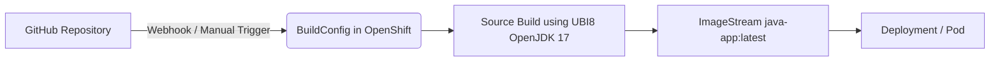

# Java BuildConfig Example on OpenShift

This repository demonstrates how to build and deploy a simple Java application in **OpenShift** using a `BuildConfig` with source code from a Git repository.

---

## 📋 Prerequisites

- Access to an **OpenShift** cluster with the `oc` CLI installed and logged in.
- A GitHub account with a personal access token (PAT).
- Basic knowledge of OpenShift Projects, ImageStreams, and BuildConfigs.

---

## 🚀 Quick Start (Recommended)

If you simply want to use the existing code in this repository:

1. **Fork this repository** to your GitHub account.
2. Update the **GitHub secrets** and **BuildConfig** to point to your fork.
3. Apply the OpenShift configuration (steps in [Deployment on OpenShift](#-deployment-on-openshift)).

---

## 🛠 Optional: Create the Java Project from Scratch

If you want to build your own project instead of forking:

### 1️⃣ Create a Maven Project
```
mvn archetype:generate \
    -DgroupId=com.example \
    -DartifactId=myapp \
    -DarchetypeArtifactId=maven-archetype-quickstart \
    -DinteractiveMode=false
````

Move into the project directory:

```bash
cd myapp
```

### 2️⃣ Update `pom.xml`

Replace with:

```xml
<project xmlns="http://maven.apache.org/POM/4.0.0"
         xmlns:xsi="http://www.w3.org/2001/XMLSchema-instance"
         xsi:schemaLocation="http://maven.apache.org/POM/4.0.0
                             https://maven.apache.org/xsd/maven-4.0.0.xsd">
    <modelVersion>4.0.0</modelVersion>

    <groupId>com.example</groupId>
    <artifactId>myapp</artifactId>
    <version>1.0-SNAPSHOT</version>
    <packaging>jar</packaging>

    <properties>
        <maven.compiler.source>17</maven.compiler.source>
        <maven.compiler.target>17</maven.compiler.target>
    </properties>

    <dependencies>
        <dependency>
            <groupId>junit</groupId>
            <artifactId>junit</artifactId>
            <version>4.13.2</version>
            <scope>test</scope>
        </dependency>
    </dependencies>

    <build>
        <plugins>
            <plugin>
                <groupId>org.apache.maven.plugins</groupId>
                <artifactId>maven-compiler-plugin</artifactId>
                <version>3.10.1</version>
                <configuration>
                    <source>${maven.compiler.source}</source>
                    <target>${maven.compiler.target}</target>
                </configuration>
            </plugin>
        </plugins>
    </build>
</project>
```

Commit and push this code to your GitHub repository.

---

## 📦 Deployment on OpenShift

### 1️⃣ Create a New Project

```bash
oc new-project java-bc
```

### 2️⃣ Create Secrets for GitHub Access

```bash
oc create secret generic github-https \
    --type=kubernetes.io/basic-auth \
    --from-literal=username=GITHUB_USER \
    --from-literal=password=YOUR_PAT \
    --namespace=java-bc
```

```bash
oc create secret generic github-webhook \
    --from-literal=WebHookSecretKey=MY_WEBHOOK_SECRET \
    --namespace=java-bc
```

> Replace:
>
> * `GITHUB_USER` → your GitHub username
> * `YOUR_PAT` → your personal access token
> * `MY_WEBHOOK_SECRET` → your chosen webhook secret

### 3️⃣ Create an ImageStream

```bash
oc create imagestream java-app -n java-bc
```

### 4️⃣ Apply the BuildConfig

Save this as `buildconfig.yaml`:

```yaml
apiVersion: build.openshift.io/v1
kind: BuildConfig
metadata:
  name: java-app-git
  namespace: java-bc
spec:
  output:
    to:
      kind: ImageStreamTag
      name: 'java-app:latest'
  resources: {}
  successfulBuildsHistoryLimit: 2
  failedBuildsHistoryLimit: 1
  strategy:
    type: Source
    sourceStrategy:
      from:
        kind: ImageStreamTag
        namespace: openshift
        name: 'ubi8-openjdk-17:1.18'
      incremental: false
  source:
    type: Git
    git:
      uri: 'YOUR_REPO_URL'
      ref: main
    sourceSecret:
      name: github-https
  triggers:
    - type: ConfigChange
    - type: ImageChange
      imageChange: {}
    - type: GitHub
      github:
        secretReference:
          name: github-webhook
  runPolicy: Serial
```

Apply it:

```bash
oc apply -f buildconfig.yaml
```

### 5️⃣ Start the Build

```bash
oc start-build java-app-git --follow
```

---

## 🔍 Verification

```bash
oc get builds
oc get is java-app
```

## Note: this program has been designed for only to test the functionality of buildconfigs, there is no guarantee of running any kind of HTTP service for test.

---

## 📊 Workflow Diagram



This diagram shows:

1. Code is pushed to GitHub.
2. Webhook or manual trigger starts a BuildConfig.
3. OpenShift builds the Java application image.
4. Image is stored in an ImageStream.
5. Image is used for Deployment or Pod creation.

---

## 📚 References

* [OpenShift BuildConfig Documentation](https://docs.openshift.com/container-platform/latest/cicd/builds/understanding-buildconfigs.html)
* [Maven Official Guide](https://maven.apache.org/guides/)

---

